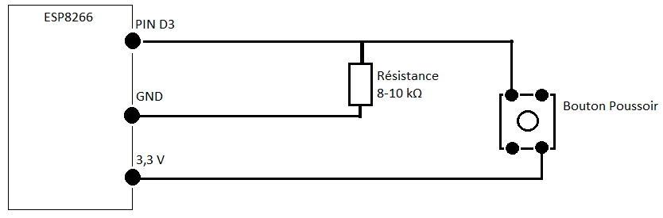

# Smart Unlock
### Votre porte d'entrée connectée
#### Réalisée avec [Constellation](http://www.myconstellation.io/ "Lien vers Constellation")

Smart Unlock vous permet d'ouvrir simplement votre porte d'entrée par reconnaissance faciale. L’autre point fort de ce projet est le faible coût des composants, c’est pourquoi cela en fait une solution adaptée pour tout le monde.


<<<<<<< HEAD
Voici le fonctionnement général de « Smart Unlock ». Une personne sonne à la porte, une photo est alors prise par la caméra. La reconnaissance faciale commence grâce à « Microsoft Cognitive Services ». Si le visage est reconnu, la porte s’ouvre sinon la photo de la personne ayant sonné vous est envoyée sur vos différents appareils. Vous pouvez, si vous le désirez, ouvrir à distance votre porte d'entrée grâce à une application mobile ou un site web.


## Sommaire 

[Prérequis](#prérequis)

[Etape 1 - Réalisation de la serrure](#etape-1-réalisation-de-la-serrure)

[Etape 2 - Réalisation de la sonnette](#etape-2-réalisation-de-la-sonnette)

- [Partie hardware](#partie-hardware)
- [Partie Software](#partie-software)
- [Partie réalisation 3D](#partie-réalisation-3d)

[Etape 3 - Caméra IP](#etape-3-caméra-ip)

[Etape 4 - Reconnaissance Faciale](#etape-4-reconnaissance-faciale)

[Etape 5 – Site web et application mobile](#etape-5-site-web-et-application-mobile)

## Prérequis<a id="Prerequis"></a>

<ul>
  <li>Un serveur Constellation</li>
  <li>Deux boutons poussoirs</li>
  <li>Deux ESP8266</li>
  <li>Une caméra IP</li>
  <li>Du fil électrique </li>
  <li>Une résistance 8 à 10 kΩ</li>
  <li>Une gâche électrique 12V / 500 A</li>
  <li>Un régulateur de tension LM1117</li>
  <li>Deux condensateurs 0,1 µF et 0,33 µF</li>
  <li>Une batterie ou un adaptateur 12V</li>
  <li>Un transistor NPN TIP 110 ou un relais 12V</li>
</ul>

A titre d'exemple, voici [le lien](https://www.amazon.fr/Floureon-Surveillance-D%C3%A9tection-Mouvement-Smartphone/dp/B01N2WDVL4/ref=sr_1_2?s=electronics&ie=UTF8&qid=1529748822&sr=1-2&keywords=camera+ip+floureon) correspondant à la caméra que nous avons utilisé.

## <a id="Etape1"></a>Etape 1 - Réalisation de la serrure
Pour concevoir la serrure nous avons suivi [cet article](https://developer.myconstellation.io/tutorials/creer-une-serrure-connectee-constellation/) disponible sur le site de Constellation. 
Cependant, nous avons choisi d'utiliser un relais à la place du transistor. Voici le schéma final : 
 

 


Nous avons aussi ajouté un bouton poussoir à l’intérieur de la maison afin de pouvoir déverrouiller la serrure et ouvrir la porte de l’intérieur.

## Etape 2 - Réalisation de la sonnette<a id="Etape2"></a>

### Partie hardware<a id="Etape2-hardware"></a>

La réalisation de la sonnette est très simple. Il vous faut utiliser :
<ul>
  <li>Un ESP8266</li>
  <li>Une résistance 8 à 10 kΩ</li>
  <li>Un bouton poussoir</li>
</ul>
 


### <a id="Etape2-software">Partie Software</a>

Connectez votre ESP8266 à votre Wifi et à Constellation. Ensuite, il faut publier un StateObject de la façon suivante pour connaitre l’état de la sonnette en temps réel :
```c#
constellation.pushStateObject("etatSonnette", "{'etat':0}","DATA",10); 
```
Ensuite dans la fonction loop on modifie le StateObject en fonction de l’état du bouton poussoir.
```c#
    if(digitalRead(BP)==HIGH){
      constellation.pushStateObject("etatSonnette","{'etat':1}","DATA");
      delay(1000);
    }
    else constellation.pushStateObject("etatSonnette","{'etat':0}","DATA");
```
### Partie réalisation 3D<a id="Etape2-3D"></a>

Nous avons réalisé un cache pour la sonnette sur un logiciel de modélisation 3D afin que cela soit plus esthétique. Nous l’avons imprimé grâce à une imprimante 3D.


## Etape 3 - Caméra IP<a id="Etape3"></a>

Nous avons connecté la caméra IP au réseau internet puis nous l’avons connectée à ZoneMinder dont le package est disponible sur Constellation. Le tutoriel pour installer le package ZoneMinder est disponible [ici](https://developer.myconstellation.io/package-library/zoneminder/). Cela nous permet d’avoir une photographie de l’individu au moment où celui-ci appuie sur la sonnette.

ZoneMinder vous permet de gérer plusieurs caméras simultanément afin d’adapter « Smart Unlock » à vos besoins.

## Etape 4 - Reconnaissance Faciale<a id="Etape4"></a>

Pour reconnaitre les différents visages, nous avons utilisé [Face API de Cognitive Services](https://docs.microsoft.com/fr-fr/azure/cognitive-services/face/quickstarts/csharp).
Vous devrez vous créer un compte afin d'obtenir une "Subscription Key" qui est obligatoire pour utiliser Face API.
Afin de détecter une tête sur l'image à analyser, il suffit d’utiliser [Face Detection](https://docs.microsoft.com/fr-fr/azure/cognitive-services/face/quickstarts/csharp). Bien sûr, nous vous laissons le choix d'adapter le programme présent sur le site à votre gré. Dans notre cas, ce qui nous intéresse concerne exclusivement la faceId, que nous conservons dans une variable.
Pour obtenir les faceId des personnes autorisées à ouvrir la porte, nous parcourons le dossier où les photos sont rangées puis récupérons les différentes faceId dans une liste.
Ensuite, il faut identifier les personnes sur l'image à l'aide de [Face Verification](https://westus.dev.cognitive.microsoft.com/docs/services/563879b61984550e40cbbe8d/operations/563879b61984550f3039523a). Si la personne est reconnue, on appelle le message callback « OpenDoor » afin d'ouvrir la porte. Sinon, on envoie sur les différents appareils du propriétaire un message grâce à PushBullet (dont le package est disponible sur Constellation) contenant la photo prise par la caméra et en indiquant que quelqu'un a sonné.


Afin de comparer deux photos voici comment nous procédons :
```c#
     int i = 0;
     while (i < listeFaceIDTemoins.Length && !samePerson)
     {
        Result_face_verify verif = await MakeRequestFaceVerify(listeFaceIDTemoins[i], faceId2);
                    
        if (verif.IsIdentical == true)
        {
           samePerson = true;
           PackageHost.CreateMessageProxy("SerrurePackage").OpenDoor();
        }
        i++;
     }
```
Nous parcourons la liste contenant les faceID des photos témoins. Chaque faceID de la liste est envoyé aux Cognitive Services avec le faceID de la photo prise par la caméra.
En fonction de la réponse de cette fonction, on peut :

  • Ouvrir la porte directement grâce au message callback :
```c#
    PackageHost.CreateMessageProxy("SerrurePackage").OpenDoor();
```
  • Envoyer la photo sur les différents appareils du propriétaire :
```c#
    PackageHost.CreateMessageProxy("PushBullet").PushFile(@"D:\Images\image.jpg", "Ca sonne !", "Device");
```
## Etape 5 – Site web et application mobile<a id="Etape5"></a>

L’utilité de ces deux interfaces est tout simplement d’ouvrir la porte à distance. Concernant l’application, nous l’avons développée avec Ionic ce qui nous permet d’utiliser sensiblement le même code que le site web.

Pour créer l’application avec Ionic vous devez d’abord disposer de Node.js et npm.
Il faut ensuite installer Ionic depuis l’invite de commande :

    nmp install – g cordova ionic

Placez-vous dans le dossier dans lequel vous souhaitez développer votre application grâce à la commande cd. Une fois que vous y êtes il faut créer un nouveau projet comme ceci :

    ionic start myApp tabs --type ionic1

Maintenant, il faut modifier votre page html. Pour connecter le site ou l’application à Constellation, référez-vous à [ce tutoriel](https://developer.myconstellation.io/getting-started/connectez-vos-pages-web-constellation/). Vous serez aussi en mesure de vous abonner à un StateObject et d’appeler un message callback.
Il y a une petite différence entre l’application mobile et le site web. Le code javascript devra se trouver dans le fichier app.js et le controller devra se trouver dans le fichier controllers.js pour l’application alors que pour le site web nous pouvons tout rassembler dans le fichier html en utilisant les balises "script". 

Voici à quoi ressemble notre application :


Nous disposons d’un bouton pour ouvrir la porte et un indicateur qui nous donne en temps réel l’état de la porte.

Il est possible de créer l’application sous forme .apk (tutoriel [ici](https://ionicframework.com/docs/v1/guide/publishing.html)), c’est ce que nous avons fait car cela nous permet de disposer de l’application sur plusieurs téléphones. 

Pour le site web, nous avons ajouté un script qui permet de prendre une photo depuis la webcam de son ordinateur afin d’ajouter facilement une personne autorisée à ouvrir la porte grâce à la reconnaissance faciale.


Ce qui se trouve dans le site ou l’application est parfaitement intégrable dans vos projets déjà existant.
=======


Démonstration :


>>>>>>> 21994e075c41279e65235db4aa7eb00b9894735b
